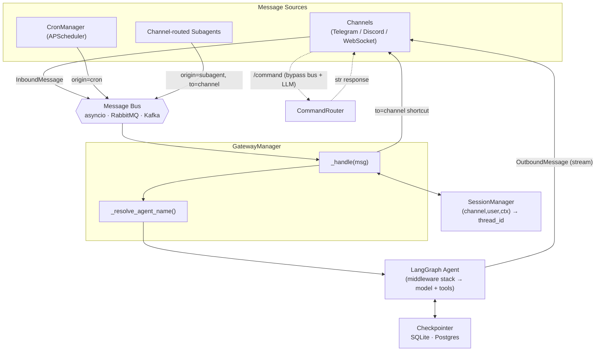

# Langclaw Development Guide

Multi-channel AI agent framework built on LangChain, LangGraph, and deepagents.

See @AGENTS.md for package map and code conventions.
See [docs/ARCHITECTURE.md](docs/ARCHITECTURE.md) for design rationale and detailed flow diagrams (read on demand — not auto-loaded).

## Working Principles (read before doing anything)

langclaw is a **framework** — its product is the developer's experience building on it. Before writing code:

1. **Big picture first.** In 1–2 lines, state how the change fits langclaw's architecture/vision (bus → gateway → agent; pluggable backends; explicit registration) and which existing primitive it extends. If a task would benefit from a different sequencing or a smaller first slice that lands the vision, say so before starting.
2. **Design the DX before the internals.** For anything developer-facing — `@app.*` decorators, config keys, commands, error messages, public names — lead with the cleanest surface: clear names, helpful errors, honest docstrings, the fewest new concepts. Optimize for the person `pip install`-ing langclaw, not the fastest internal hack.
3. **Be langclaw-native.** Prefer the existing pattern (bus message source, middleware, registry + factory, `BaseStore`) over porting an external design. New name-minting or pluggable things go through the established seam (e.g. `langclaw/naming.py`, `make_*` factories) and scale by one declaration.
4. **Centralize over scatter; flag reuse/scope tradeoffs** before implementing, not after.
5. **Don't cap.** Separate what is wired and works from inert scaffolding; lead with the honest limitation. Use red/green TDD.

## Quick Reference

```bash
uv sync --group dev              # Install all deps
uv run pytest tests/ -v          # Run tests
uv run ruff check . --fix        # Lint + auto-fix
uv run ruff format .             # Format code
uv run pre-commit run --all-files  # Full pre-commit suite
```

## Key File Locations

| Task | Primary File(s) |
|------|-----------------|
| Add built-in tool | `langclaw/agents/tools/` + export in `__init__.py` |
| Add channel | `langclaw/gateway/<name>.py` subclassing `BaseChannel` |
| Add middleware | `langclaw/middleware/` + wire in `agents/builder.py` |
| Add RBAC capability axis | `langclaw/rbac.py` (`CapabilityAxis` in `CAPABILITY_AXES`, pick an enforcement shape) + a field on `RoleConfig` + (if prefixed) reserve the prefix in `langclaw/naming.py`; `validate_capability_registry` checks all three at startup |
| Add message bus | `langclaw/bus/<name>.py` + factory in `bus/__init__.py` |
| Add checkpointer | `langclaw/checkpointer/<name>.py` + factory in `checkpointer/__init__.py` |
| Choose agent backend | `langclaw/agents/backend.py` (`make_backend` factory + `backend_root_dir`) |
| Modify config schema | `langclaw/config/schema.py` (Pydantic Settings) |
| Code interpreter (RLM) | `langclaw/interpreter/__init__.py` (PTC resolver + middleware factory) |
| Runtime workflow authoring | `langclaw/workflows/saved_store.py` (parse/load) + `app._reload_saved_workflows` + gateway folder-watch |
| CLI commands | `langclaw/cli/app.py` (Typer) |
| Agent construction | `langclaw/agents/builder.py` |
| Gateway orchestration | `langclaw/gateway/manager.py` |
| Register named agents | `langclaw/app.py` (`app.agent()`) |
| Agent routing logic | `langclaw/gateway/manager.py` (`_resolve_agent_name`) |
| Active agent persistence | `langclaw/session/manager.py` (`get_active_agent` / `set_active_agent`) |

## Extension Patterns

### Adding a Channel

Subclass `BaseChannel` in `langclaw/gateway/base.py`:

```python
class MyChannel(BaseChannel):
    name = "my_channel"

    async def start(self, bus: BaseMessageBus) -> None:
        # Connect and publish InboundMessage to bus
        ...

    async def send_ai_message(self, msg: OutboundMessage) -> None:
        # Deliver AI response to user (required)
        ...

    async def stop(self) -> None:
        # Cleanup resources
        ...

    # Optional overrides:
    # async def send_tool_progress(self, msg) -> None: ...
    # async def send_tool_result(self, msg) -> None: ...
```

Add config in `config/schema.py`, enable in `app.py:_build_all_channels()`.

### Adding a Message Bus

Subclass `BaseMessageBus` in `langclaw/bus/base.py`:

```python
class MyBus(BaseMessageBus):
    async def start(self) -> None: ...
    async def stop(self) -> None: ...
    async def publish(self, msg: InboundMessage) -> None: ...
    def subscribe(self) -> AsyncIterator[InboundMessage]: ...
```

Register in `bus/__init__.py:make_message_bus()` factory.

### Adding Middleware

Create in `langclaw/middleware/`, then add to stack in `agents/builder.py`:

```python
middleware: list[Any] = [
    ChannelContextMiddleware(),      # 1. Inject channel metadata (first)
    # ToolPermissionMiddleware,      # 2. RBAC filtering (if enabled)
    RateLimitMiddleware(...),        # 3. Rate limiting
    ContentFilterMiddleware(...),    # 4. Content filtering
    PIIMiddleware(...),              # 5. PII redaction
    *(extra_middleware or []),       # 6. User-provided (last)
]
```

Order matters: earlier middleware runs first on input, last on output.

### Adding a Checkpointer

Subclass `BaseCheckpointerBackend` in `langclaw/checkpointer/base.py`:

```python
class MyCheckpointer(BaseCheckpointerBackend):
    async def __aenter__(self) -> Self: ...
    async def __aexit__(self, *_) -> None: ...
    def get(self) -> Checkpointer: ...  # Return LangGraph checkpointer
```

Register in `checkpointer/__init__.py:make_checkpointer_backend()`.

### Named Agents (multi-agent switching)

Register independent named agents on the app. Each gets its own LangGraph thread
(`context_id = "agent:<name>"`) so conversation history never bleeds across agents.

```python
app.agent(
    "researcher",
    description="Deep research with web tools",
    system_prompt="You are a meticulous researcher. Always cite sources.",
    tools=[web_search, web_fetch],          # None → inherits config-driven tools
    model="openai:gpt-4.1",                 # None → inherits default model
)
```

Users interact via the built-in `/agent` command (registered automatically):

```
/agent                          → list all agents with active marker
/agent researcher               → switch to researcher agent (persistent)
/agent default                  → return to main agent
/agent researcher What is X?    → one-off message to researcher (no session change)
```

WebSocket clients can also specify the target agent via metadata:

```json
{
  "type": "message",
  "content": "Summarize the quarterly report",
  "metadata": { "agent_name": "researcher" }
}
```

**`_resolve_agent_name` priority order** (in `gateway/manager.py`):
1. `msg.metadata["agent_name"]` — stamped by cron at schedule time (deterministic, restart-safe)
2. Phase 2 `agent_resolver` hook — auto-routing (not yet implemented; stub in `_resolve_agent_name`)
3. `SessionManager.get_active_agent()` — set by `/agent` (per user, in-memory)
4. `"default"` — fallback

**Cron + named agents:** The cron tool derives `agent_name` from `ctx.context_id`
(set to `"agent:<name>"` when a named agent is active) at schedule time and stamps it
into the job's `fire_kwargs`. On fire, it appears in `InboundMessage.metadata["agent_name"]`
and takes priority over the user's current interactive session. Old persisted jobs without
the field default to `""` and fall through to the next priority level — fully backward compatible.

**Adding Phase 2 auto-routing:** Uncomment the `agent_resolver` stub in
`GatewayManager._resolve_agent_name` and wire a `Callable[[InboundMessage], Awaitable[str | None]]`
through `GatewayManager.__init__` and `Langclaw._run_async`.

## Message Flow

High-level component architecture — all sources (channels, cron, subagents) converge on the same bus → `_handle()` pipeline:



Detailed end-to-end sequence, middleware-order, and bypass-path diagrams:
[docs/ARCHITECTURE.md#message-flow-diagrams](docs/ARCHITECTURE.md#message-flow-diagrams).

Key routing fields on `InboundMessage`:
- `origin`: `"user"` | `"cron"` | `"heartbeat"` | `"subagent"`
- `to`: `"agent"` (default) | `"channel"` (bypass agent)
- `metadata["agent_name"]`: explicit agent target (stamped by cron at schedule time)

## Common Pitfalls

### Tool Error Handling

Tools must return error dicts, never raise into the agent:

```python
@app.tool()
async def my_tool(query: str) -> dict:
    try:
        return {"result": do_work(query)}
    except SomeError as e:
        return {"error": str(e)}  # Correct
        # raise  # Wrong — breaks agent loop
```

### Type Annotations

Use modern syntax (Python 3.11+):

```python
# Correct
def foo(items: list[str], value: int | None = None) -> dict[str, Any]: ...

# Wrong — never use typing module equivalents
def foo(items: List[str], value: Optional[int] = None) -> Dict[str, Any]: ...
```

### Logging

Use loguru with f-strings, not stdlib logging:

```python
from loguru import logger

logger.info(f"Processing message from {user_id}")
logger.error(f"Failed to connect: {exc}")
```

### Commands vs Tools

- **Commands** (`/start`, `/reset`, `/help`, `/agent`): Fast system ops, bypass bus and LLM entirely
- **Tools**: LLM-invoked functions, go through full middleware pipeline

Don't implement user-facing quick actions as tools — use `@app.command()`.

`/agent` is registered automatically by `GatewayManager._setup_agent_command()` as a closure
when at least one named agent exists. It calls `SessionManager.set_active_agent()` for persistent
switches and publishes directly to the bus for one-off messages.

## Testing

```bash
uv run pytest tests/ -v                    # All tests
uv run pytest tests/test_gateway.py -v     # Specific module
uv run pytest -k "test_telegram" -v        # Pattern match
```

Tests use `pytest-asyncio` with `asyncio_mode = "auto"`.

## Environment Variables

Config uses `LANGCLAW__` prefix with nested `__` delimiters:

```bash
LANGCLAW__AGENTS__MODEL=openai:gpt-4.1
LANGCLAW__CHANNELS__TELEGRAM__TOKEN=bot123:abc
LANGCLAW__CHANNELS__TELEGRAM__ENABLED=true
LANGCLAW__BUS__BACKEND=rabbitmq
LANGCLAW__CHECKPOINTER__BACKEND=postgres
LANGCLAW__AGENTS__BACKEND__BACKEND=filesystem   # drop the host `execute` shell tool
LANGCLAW__INTERPRETER__ENABLED=true        # opt into the sandboxed `eval` tool
```

## Agent Backend (filesystem / shell)

deepagents abstracts the agent's file tools (`ls` / `read_file` / `write_file` /
`edit_file` / `glob` / `grep`, plus `execute` on shell backends) behind a
swappable backend. `langclaw/agents/backend.py:make_backend()` builds one from
`config.agents.backend`; `create_claw_agent(backend=...)` and
`Langclaw(backend=...)` accept a fully-constructed instance (or a
`Callable[[ToolRuntime], BackendProtocol]`) for the advanced backends config
can't express (`StoreBackend` with a custom store/namespace, `CompositeBackend`,
a sandbox).

- **Default is `local_shell`** (`LocalShellBackend`) — real files under the
  agent workspace **plus** an `execute` tool. `virtual_mode=True` sandboxes file
  *paths* to the workspace, but `execute` runs host shell commands **unsandboxed**
  (`subprocess`). Select `filesystem` (`LANGCLAW__AGENTS__BACKEND__BACKEND=filesystem`)
  to keep the file tools without `execute`.
- **Other backends:** `state` (files live in LangGraph thread state) and `store`
  (files in a LangGraph `BaseStore`, cross-thread) need no host filesystem.
- **`backend_root_dir(backend)`** returns the host directory for filesystem-rooted
  backends (`FilesystemBackend` / `LocalShellBackend`) and `None` otherwise. The
  builder keys every local-filesystem assumption off it: the workspace `mkdir`,
  the langclaw-specific `move_file` / `delete_file` tools, and the on-disk
  `AGENTS.md` read are skipped for `state` / `store` backends, which fall back to
  the packaged default prompt and rely on deepagents' own backend-delegated file
  tools.

## Code Interpreter (RLM)

Opt-in sandboxed JavaScript `eval` tool (off by default) backed by
`langchain-quickjs`'s `CodeInterpreterMiddleware`. Lets the agent write a
script that loops, branches, retries, and fans out over a role-filtered PTC
allowlist of tools — including `tools.task({subagent_type})` to orchestrate
`app.subagent()` subagents.

- **Enable:** `LANGCLAW__INTERPRETER__ENABLED=true` or `Langclaw(enable_interpreter=True)`.
  Requires the extra: `uv add 'langclaw[interpreter]'`.
- **Security posture:** the QuickJS sandbox is *capability-scoped, not host-memory
  isolation*. The real blast radius is the exposed tools, so the PTC allowlist
  (`langclaw/interpreter/__init__.py:DEFAULT_READONLY_PTC_TOOLS`) defaults to
  read-only; mutating/egress tools require explicit `interpreter.allow_tools`
  opt-in.
- **Per-call RBAC falls out of middleware ordering** — the interpreter middleware
  is appended *after* the unified capability filter (`build_capability_filter_middleware`)
  in `agents/builder.py`, so PTC only ever sees the role-filtered live toolset.
  `resolve_ptc_allowlist` and the filter both resolve through the one
  `langclaw/rbac.py:resolve_capability` so they cannot drift.
- **Unified RBAC seam** (`langclaw/rbac.py`) — tools, subagents, and workflows
  are three `CapabilityAxis` declarations in `CAPABILITY_AXES`, each binding a
  `RoleConfig` field to one default-deny-vs-pass-through flag; `resolve_capability`
  is the single resolver. Each axis declares its **enforcement shape**: a
  `tool_prefix` (prefixed tool axis), `is_residual_tool_axis` (the bare tool
  namespace), or `arg_gated` (enforced on a tool *argument*, like `subagents` on
  `task`'s `subagent_type`). One `wrap_model_call` filter governs both
  tool-name-mapped axes (tools + `workflow_<name>`); the arg-gated subagent axis
  keeps its dedicated `wrap_tool_call` gate. **Adding an axis** = a `CapabilityAxis`
  in `CAPABILITY_AXES` + a `RoleConfig` field + (for a prefixed axis) a reserved
  prefix in `langclaw/naming.py`. `validate_capability_registry` enforces all of
  this at startup (called from `build_capability_filter_middleware` and
  `create_claw_agent`): an axis wired to **no** enforcement shape, a missing
  `RoleConfig` field, or an unreserved prefix raises a `ValueError` instead of
  silently failing open. See `examples/rbac_showboat.py` for a runnable tour.
- **Subagents are governed by the same seam:** a subagent that inherits the
  toolset (no `tools` in its spec) carries the unified filter, so the default-deny
  **workflow** axis applies inside subagents too — a `workflow_<name>` tool is
  reachable from a subagent only when the role explicitly grants that workflow
  (consistent with the main agent; not a silent pass-through).
- **Subagent gate:** `RoleConfig.subagents` is a per-role, default-deny allowlist
  of subagent types a script may reach via `tools.task`
  (`allowed_subagents` / `check_subagent_permission`).

## Runtime Workflow Authoring (file-edit)

The bridge between the throwaway `eval` script and the durable workflow
primitive. There is **no bespoke save tool** — the agent saves a workflow by
writing a file with its ordinary `write_file`. Active when **both**
`workflows.enabled` and `interpreter.enabled` are on **and** the backend is
filesystem-rooted (`local_shell` default / `filesystem`). Flow:

1. User: *"Run a workflow to: …"* → the agent writes an `eval` program (the
   `<code_interpreter>` nudge routes "run a workflow"/"orchestrate" phrasing here).
2. User: *"Save that workflow as hn_digest"* → the agent calls
   `write_file("workflows/hn_digest.js", <the same JS>)`. The convention (taught
   in the `<workflows>` nudge): name `[A-Za-z0-9_]+` (snake_case, no hyphens — a
   hyphen makes the in-sandbox `tools.workflow_my-flow` un-callable); optional
   `// @description` and `// @uses a, b` header comments; body gets `inp`, emits
   via `tools.output({result})`, and may narrate progress via
   `tools.phase({name})` / `tools.log({message})` — the sandbox counterparts of a
   Python workflow's `ctx.phase` / `ctx.log`, surfaced through the same
   `emit_progress` → `render_workflow_progress` channel stream (wired in
   `runtime._progress_callbacks`, exposed by `js_runner.build_workflow_script_runner`).
3. **Same-session liveness:** `GatewayManager._ensure_agent_fresh` hashes the
   `workflows/` folder (alongside the AGENTS.md content hash). On change it calls
   the `saved_reload_cb` → `app._reload_saved_workflows()`, which reconciles files
   into the registry (add/update/remove `mode="saved"` specs), bumping
   `registry.version` → rebuilds the **default** agent so `workflow_<name>` goes
   live without a restart. The rebuild threads `workflow_registry`/`workflow_runtime`
   through (previously an AGENTS.md reload silently dropped workflow tools).
4. **Restart:** the same reconcile runs in `_run_async` before the agent build.

**`mode="saved"` execution:** the frozen `spec.script` (the file contents) runs
verbatim via `build_workflow_script_runner` (same QuickJS path as `llm_authored`,
minus the per-run authoring step) — `runtime._run_saved`. Saved workflows are
global (default agent only); named agents don't carry workflow tools.

**Scheduling a saved workflow:** the agent `cron` tool takes `workflow_name`
(+ optional JSON `workflow_input`) → `CronManager.add_job` → fires
`origin="workflow"` → `GatewayManager._handle_workflow` runs the frozen script
**without** the LLM (deterministic). Prefer this over a prose `task` job that
re-describes the steps (the LLM would re-author it freehand every fire).
**Self-disarm:** the cron job references the workflow by string name. If the
`.js` is deleted (via the agent *or* straight in the folder), `_handle_workflow`
reconciles from disk first (so manual deletes are seen), then — when the name no
longer resolves and the fire carries its `cron_job_id` — removes its own schedule
so it stops re-firing. `/workflows run` (no `cron_job_id`) just reports the
unknown name.

**Parsing/format:** `langclaw/workflows/saved_store.py` — `parse_metadata` reads
the `// @` header; `render_saved_file` writes the canonical form (used by
`SavedWorkflowStore.save` and mirrored by the prompt). The `.js` file is the
source of truth (editable, version-controllable).

**Honest limits:** requires *both* flags **and** a filesystem-rooted backend —
`state`/`store` backends have no host folder for the agent's `write_file` / the
loader, so file-authoring is gated off there. The folder is rooted at the backend
fs root (`workflows_dir`) so it matches where `write_file` lands. A saved body is
JS in the eval sandbox; its capability surface is the workflow step toolset
narrowed by `@uses`. Saved-mode resume is at-least-once / non-idempotent (no
per-step memoization), like `llm_authored`.
