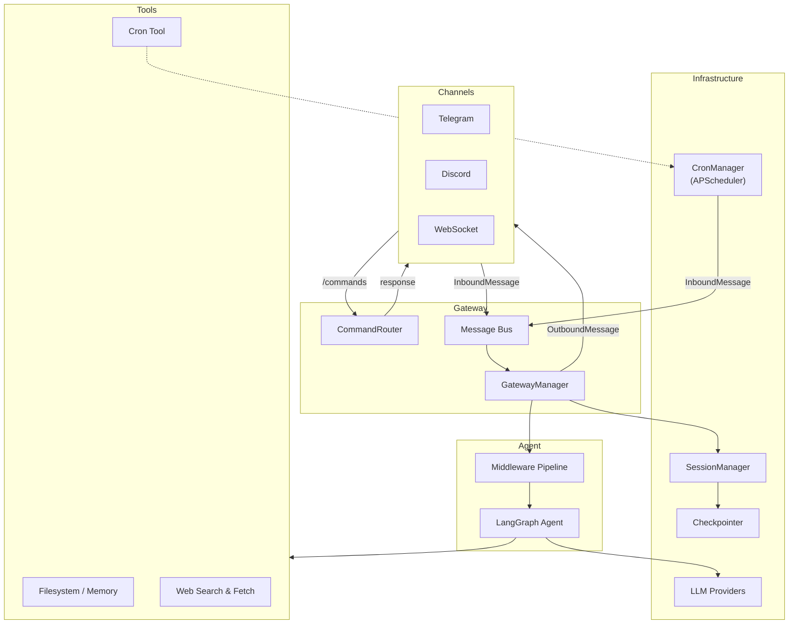

# langclaw

A **framework** for building multi-channel AI agent systems — with scheduled tasks, persistent memory, RBAC, and a pluggable tool ecosystem — on top of LangChain, LangGraph, and deepagents.

## Vision

Langclaw is not a fork-to-use application. It is a framework that developers `pip install` and build upon. The primary interface is the `Langclaw` application class:

```python
from langclaw import Langclaw

app = Langclaw()

@app.tool()
async def get_stock_price(ticker: str) -> str:
    """Fetch the latest stock price."""
    return await fetch_price(ticker)

app.role("analyst", tools=["get_stock_price", "web_search", "cron"])
app.role("viewer", tools=["web_search"])

if __name__ == "__main__":
    app.run()
```

Think Flask/FastAPI for web apps — langclaw is that for multi-channel agentic systems.

## Quick start

```bash
pip install langclaw
langclaw init          # scaffold ~/.langclaw/ with config and workspace
```

### Option A: Use the CLI (zero custom code)

```bash
# Configure channels and providers in .env or ~/.langclaw/config.json
langclaw gateway       # start all enabled channels
```

### Option B: Build your own system (the framework way)

```python
# my_bot/app.py
from langclaw import Langclaw

app = Langclaw()

@app.tool()
async def my_custom_tool(query: str) -> str:
    """A tool only my system needs."""
    return f"Result: {query}"

@app.tool(roles=["premium"])
async def premium_analysis(data: str) -> str:
    """Deep analysis — premium users only."""
    return await run_analysis(data)

app.role("premium", tools=["*"])
app.role("free_tier", tools=["web_search", "my_custom_tool"])

if __name__ == "__main__":
    app.run()
```

### Register existing LangChain tools

```python
from langclaw import Langclaw
from langchain_community.tools import WikipediaQueryRun

app = Langclaw()
app.register_tool(WikipediaQueryRun())
app.run()
```

### Add custom channels

```python
from langclaw import Langclaw
from my_project.channels import WhatsAppChannel

app = Langclaw()
app.add_channel(WhatsAppChannel(token="..."))
app.run()
```

### Register subagents

Subagents let the main agent delegate complex tasks to specialised child agents with isolated context. Results flow back through the main agent, keeping its context clean.

```python
from langclaw import Langclaw

app = Langclaw()

@app.tool()
async def web_search(query: str) -> str:
    """Search the web."""
    return await do_search(query)

app.subagent(
    "researcher",
    description="Conducts in-depth research using web search",
    system_prompt="You are a thorough researcher. Search, synthesise, cite sources.",
    tools=["web_search"],
    model="openai:gpt-4.1",
)

app.subagent(
    "analyst",
    description="Analyses data and produces concise summaries",
    system_prompt="You are a data analyst. Return key insights as bullet points.",
)

if __name__ == "__main__":
    app.run()
```

### Use third-party tool packs

```python
from langclaw import Langclaw
from langclaw_jira import jira_tools  # pip install langclaw-jira-tools

app = Langclaw()
app.register_tools(jira_tools)
app.run()
```

## Architecture



### Data flow

1. **User sends a message** on any channel (Telegram, Discord, WebSocket).
2. **Commands** (`/start`, `/reset`, `/help`, `/cron`) are handled instantly by the `CommandRouter` — they bypass the bus and never reach the LLM.
3. **Regular messages** are published as `InboundMessage` to the message bus.
4. **GatewayManager** consumes from the bus, resolves (or creates) a LangGraph thread via `SessionManager`, and streams the message through the agent.
5. **Middleware** runs before the LLM: channel context injection, RBAC tool filtering, rate limiting, content filtering, PII redaction.
6. **The agent** (LangGraph) processes the message with access to tools — filesystem/memory, web search, web fetch, and cron scheduling — plus any custom tools registered via `@app.tool()`.
7. **Streaming chunks** (tool calls, tool results, AI text) are converted to `OutboundMessage` and forwarded back to the originating channel.
8. **Cron jobs** fire on schedule and publish `InboundMessage` to the same bus, flowing through the same agent pipeline as user messages.

### Packages

| Package | Purpose |
|---|---|
| `app.py` | `Langclaw` application class — the developer's primary interface |
| `cli/` | CLI entry points (`langclaw gateway`, `langclaw cron list`, etc.) |
| `gateway/` | Channel orchestration, command routing, message dispatch |
| `bus/` | Message bus abstraction (asyncio, RabbitMQ, Kafka) |
| `agents/` | LangGraph agent construction and tool wiring |
| `middleware/` | Request pipeline (RBAC, rate limit, content filter, PII) |
| `providers/` | LLM model resolution via LangChain `init_chat_model` |
| `cron/` | Scheduled jobs via APScheduler v4 (SQLite/Postgres persistence) |
| `session/` | Maps (channel, user, context) to LangGraph thread IDs |
| `checkpointer/` | Conversation state persistence (SQLite/Postgres) |
| `config/` | Pydantic-settings configuration with env var support |

## Roadmap

### Done

- [x] **Sub-agent delegation** — `app.subagent()` registers child agents with isolated context, RBAC middleware, and per-subagent model/tool sets
- [x] **Channel-routed subagents** — subagents publish results directly to the originating channel via the message bus (`output="channel"`, `_direct_delivery` flag)
- [x] **Guardrails middleware** — `ContentFilterMiddleware` (keyword/regex blocking) and `PIIMiddleware` (redaction) in the built-in middleware stack
- [x] **Heartbeat / proactive wake-up** — event-driven condition checks that fire messages through the bus → agent pipeline (`heartbeat/watcher.py`)

### Planned

- [ ] **Multi-agent support** — named agents with distinct models and per-agent tool sets, routed by channel or user intent
- [ ] **More channels** — Slack, WhatsApp, REST API gateway
- [ ] **Test coverage** — increase test coverage across all modules

## Further reading

- [Architecture](docs/ARCHITECTURE.md) — design principles, component deep-dive, and comparison with alternative frameworks
