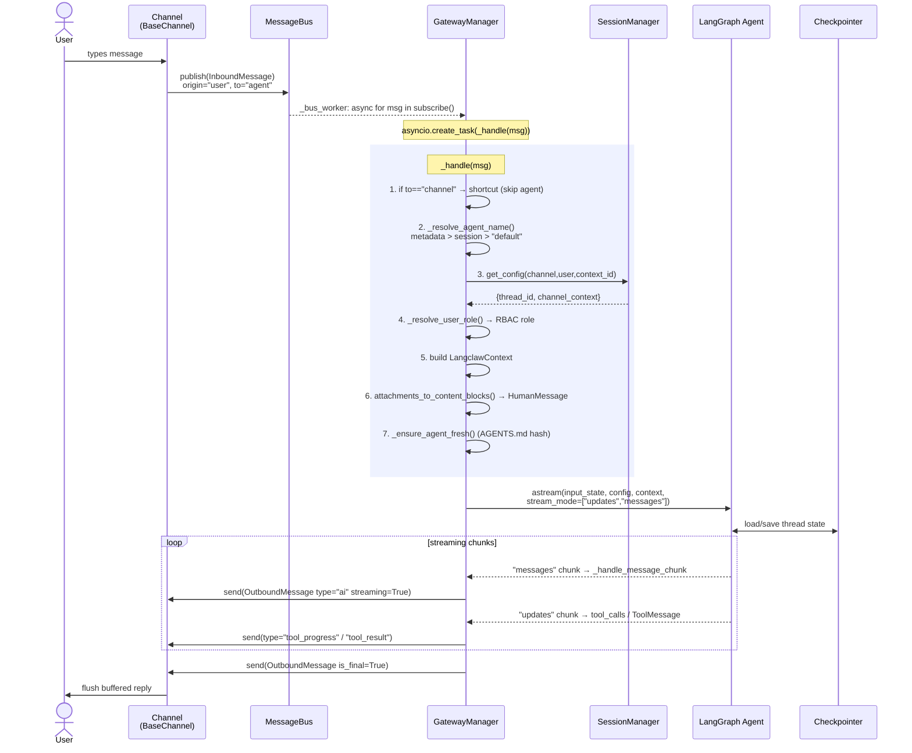
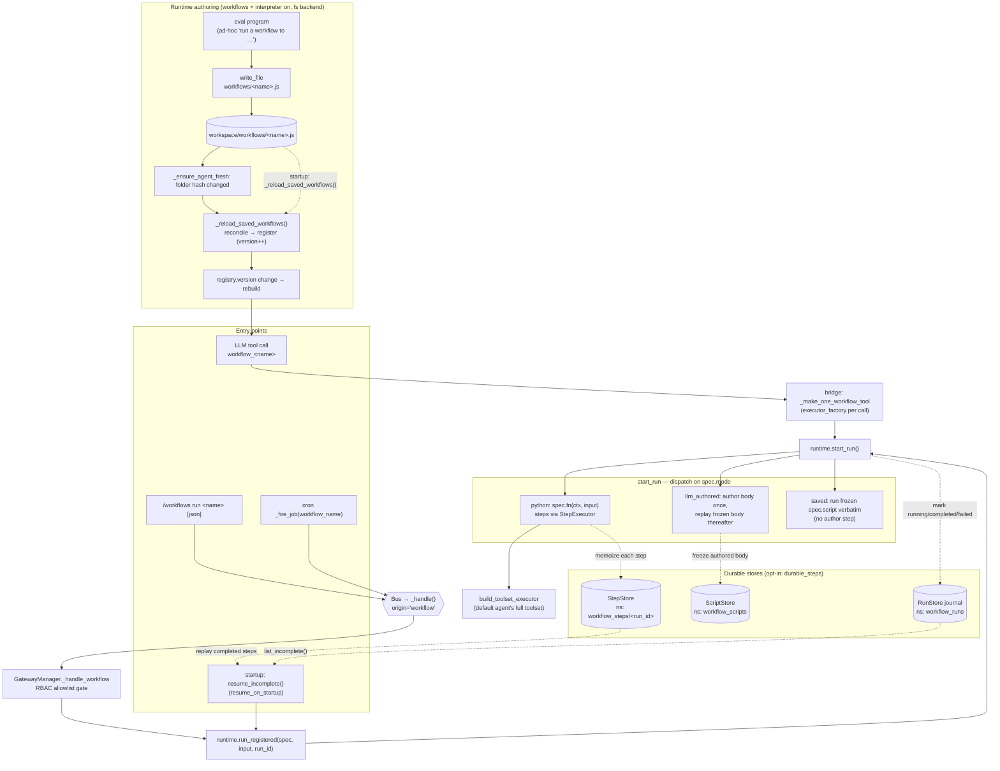

# Langclaw Architecture

This document details the core design principles and architectural decisions of the Langclaw framework. For the package map and a quick ASCII data-flow overview, see the [README](https://github.com/tisu19021997/langclaw/blob/main/README.md); the rendered component, sequence, and middleware diagrams live in [Message Flow Diagrams](#message-flow-diagrams) below.

## Message Flow Diagrams

These diagrams trace a message from a channel through the bus, gateway, middleware, and agent, and back out. They are sourced from the code — `gateway/manager.py` (`_handle`, `_resolve_agent_name`), `bus/base.py` (`InboundMessage` / `OutboundMessage`), and `agents/builder.py` (middleware stack).

> The high-level **component architecture** overview lives in the [Architecture guide](guides/architecture.md). This section drills into the runtime sequence, middleware order, and bypass paths.

### End-to-End Sequence (User → Channel)

### Middleware Pipeline (order from `agents/builder.py`)

```mermaid
flowchart LR
    IN["Input<br/>HumanMessage"] --> M1
    M1["1 · ChannelContextMiddleware<br/>inject channel/user/ctx"] --> M2
    M2["2 · capability filter<br/>tool + workflow RBAC<br/>(if permissions.enabled)"] --> M3
    M3["3 · subagent gate<br/>task subagent_type RBAC<br/>(if permissions.enabled)"] --> M4
    M4["4 · InterpreterMiddleware<br/>PTC eval sandbox<br/>(if interpreter.enabled)"] --> M5
    M5["5 · RateLimitMiddleware<br/>rpm cap"] --> M6
    M6["6 · ContentFilterMiddleware<br/>banned keywords"] --> M7
    M7["7 · PIIMiddleware<br/>redaction"] --> M8
    M8["8 · extra_middleware<br/>(user-provided, last)"] --> LLM["Model + Tools"]
    LLM --> OUT["Output<br/>(reverse order on the way out)"]
```

> Order matters: earliest runs first on input, last on output. The RBAC steps are `build_capability_filter_middleware` (tool + `workflow_<name>` visibility) and `build_subagent_permission_middleware` (the `task` subagent_type gate). The interpreter middleware is appended **after** the capability filter so its PTC surface only ever sees the role-filtered toolset (see [Code Interpreter (RLM) — Trust Boundary](#code-interpreter-rlm-trust-boundary)).

### Alternate Entry Paths (bypass / inject)

```mermaid
flowchart TB
    subgraph Command["Command path — bypasses bus + LLM"]
        direction LR
        C1["User: /reset"] --> C2["CommandRouter.dispatch(name, ctx)"]
        C2 --> C3["handler(ctx) → str"] --> C4["Channel sends reply directly"]
    end

    subgraph CronPath["Cron path — same agent pipeline"]
        direction LR
        K1["APScheduler fires"] --> K2["_fire_job()"]
        K2 --> K3["publish InboundMessage<br/>origin='cron'<br/>metadata: agent_name, user_role"]
        K3 --> K4["Bus → _handle()<br/>(role + agent pre-resolved)"]
    end

    subgraph SubPath["Subagent → channel — bypasses parent agent"]
        direction LR
        S1["Subagent output='channel' finishes"] --> S2["_run_and_publish()"]
        S2 --> S3["publish InboundMessage<br/>origin='subagent', to='channel'"]
        S3 --> S4["_handle(): to=='channel' shortcut<br/>→ send straight to Channel"]
    end

    subgraph WfPath["Workflow source — runs a whole workflow, no LLM"]
        direction LR
        W1["cron _fire_job(workflow_name)<br/>or /workflows run &lt;name&gt;"] --> W2["publish InboundMessage<br/>origin='workflow'<br/>metadata: workflow_name, workflow_input"]
        W2 --> W3["_handle(): origin=='workflow'<br/>→ _handle_workflow()"]
        W3 --> W4["RBAC allowlist gate<br/>then runtime.run_registered()"]
    end
```

Key routing fields on `InboundMessage` (`bus/base.py`):

- `origin`: `"user"` | `"cron"` | `"subagent"` | `"heartbeat"` | `"workflow"` — drives how it is handled (`"workflow"` runs the named workflow directly; the rest convert to a LangChain message type).
- `to`: `"agent"` (default, full pipeline) | `"channel"` (shortcut delivery, skips the LLM).
- `metadata["agent_name"]`: explicit agent target, stamped by cron at schedule time; highest priority in `_resolve_agent_name`.
- `metadata["workflow_name"]` / `metadata["workflow_input"]`: the workflow to run (and its JSON input) when `origin="workflow"`.

All sources (channels, cron, subagents, workflows) converge on the **same bus → `_handle()` pipeline** — the decoupling that lets the bus backend swap between asyncio/RabbitMQ/Kafka without touching the gateway. `_handle` then forks by intent: `to="channel"` short-circuits to delivery, `origin="workflow"` runs a workflow, and everything else feeds the agent. The remaining bypass is commands (never hit the bus).

### Workflow Primitive — Entry Points, Runtime, Durability

A workflow (`@app.workflow`) is a typed, multi-step orchestration. It is reachable four ways, but they all land on one `WorkflowRuntime`. The agent invokes it as the `workflow_<name>` tool (per-message bridge); the other three start a *whole run* outside the LLM via `runtime.run_registered`, which rebuilds the step executor / Mode-2 callables from factories the agent builder registered at build time.

- **One runtime, one ceiling.** Every entry shares the cached `WorkflowRuntime` (so `max_concurrent_runs` is global). Progress (`ctx.phase` / `ctx.log` / Mode-2 authored body) projects to the channel through the same request-scoped sink the agent path installs.
- **RBAC is at the invocation boundary.** Tool / command / cron / bus dispatch all consult the role's default-deny workflow allowlist (`allowed_workflow_names`). A workflow's *steps* call `tool.ainvoke` directly and bypass `ToolPermissionMiddleware`, so they run against the default agent's full toolset — constrain reachable tools via the workflow's `uses_tools`, not per-role tool RBAC.
- **Durability is opt-in.** With `durable_steps`, completed steps and frozen Mode-2 bodies persist to a LangGraph `BaseStore` (a sibling SQLite file or the Postgres DSN). With `resume_on_startup`, the run journal replays runs left `"running"` by a crash: python-mode replays only the unfinished tail; `llm_authored` replays its frozen body (steps are not individually memoized, so resume is at-least-once).
- **Runtime authoring closes the loop (`mode="saved"`).** When workflows *and* the interpreter are enabled (and the backend is filesystem-rooted), the agent saves a workflow by **writing a file** — no bespoke tool, just its ordinary `write_file`. It turns the throwaway `eval` script the user just ran into `workflows/<name>.js` (with `// @description` / `// @uses` header comments). `_ensure_agent_fresh` hashes that folder (alongside the AGENTS.md hash); on change it calls `_reload_saved_workflows()`, which reconciles the files into the registry (add/update/remove `mode="saved"` specs), bumping `registry.version` and rebuilding the **default** agent — so `workflow_<name>` goes live in the same session and reloads on restart. The folder is rooted at the backend's filesystem root so it matches where the agent's `write_file` lands; `state`/`store` backends have no host folder, so file-authoring is gated off there. A saved body runs in the same QuickJS sandbox as `eval`, reaching the workflow step toolset narrowed by `@uses`.

## Design Vision: A Framework, Not an App

Langclaw's fundamental philosophy is to be a **framework** that developers build upon, similar to FastAPI or Flask, rather than a standalone application to be forked.

### Core Tenets

1. **Explicit Registration over Implicit Magic:** Tools, channels, and middleware are registered explicitly on the `Langclaw` app object (e.g., `@app.tool()`, `app.add_channel()`). We avoid auto-discovery (like directory scanning) because explicit registration is safer and more predictable for production systems.
2. **Pluggability:** The framework provides robust abstractions (Message Bus, Checkpointer, Providers) that can easily be swapped out. You can use the built-in SQLite checkpointer or write your own Postgres implementation.
3. **Middleware-Driven Safety:** Security, rate limiting, and Role-Based Access Control (RBAC) are implemented as middleware. This ensures all interactions, regardless of the channel or tool, pass through the same security checks before reaching the LLM.

## Architectural Deep Dive

While the README shows the physical data flow, here we analyze the *why* behind the core components:

### The `Langclaw` App Class
Previously, developers had to manually wire the LangGraph agent, gateway, bus, and channels. The introduction of the `Langclaw` class unified this. It serves as the central registry and orchestrator, managing the lifecycle of the entire system (startup/shutdown hooks, tool scoping, and channel initialization).

### Message Bus (`BaseMessageBus`)
Channels and the cron scheduler do not talk to the agent directly. They publish `InboundMessage` objects to a unified bus.
- **Why?** This decoupling allows the gateway to horizontally scale. You can swap the default `asyncio` memory bus for RabbitMQ or Kafka in distributed environments.

Each `InboundMessage` has two routing fields:
- `origin`: Who produced the message (`"user"`, `"channel"`, `"cron"`, `"heartbeat"`, `"subagent"`, `"workflow"`). This drives how the message is handled — most convert to a LangChain message type; `"workflow"` runs the named workflow directly.
- `to`: Where to route (`"agent"` or `"channel"`). Messages with `to="channel"` bypass the agent and are delivered directly to the originating channel.

### Middleware Pipeline
Instead of hardcoding tool permission logic into the agent prompt, Langclaw uses a middleware pipeline (e.g., `ToolPermissionMiddleware`).
- **Why?** It securely filters the available tools based on the user's resolved role *before* the LangGraph agent even sees them, preventing prompt injection attacks from accessing restricted tools.

### Checkpointer Abstraction
Conversation state is handled by `BaseCheckpointerBackend`.
- **Why?** AI agents require persistent memory across asynchronous channel events. Abstracting this allows swapping between in-memory (testing), SQLite (local deployments), and robust databases (production) without changing agent logic.

### Workflow Primitive — Deterministic Orchestration

A workflow (`@app.workflow`, `langclaw/workflows/`) is the deterministic
counterpart to the code interpreter: where an `eval` script is LLM-authored and
free-form, a workflow is a *named, typed, durable* orchestration with a Python
body (Mode 1) or an LLM-authored-once-then-frozen body (Mode 2, `llm_authored`).

- **Why a primitive, not just a tool?** A workflow needs an identity (for RBAC,
  resume, and observability), a typed I/O contract, and a budget — things a plain
  tool lacks. The `WorkflowRuntime` owns run lifecycle, the global
  `max_concurrent_runs` ceiling, per-run step budget, and timeout.
- **One runtime, many entry points.** The agent reaches a workflow as the
  `workflow_<name>` tool; operators via `/workflows run`; schedules via cron; and
  crashed runs via startup resume. The non-tool entries call `run_registered`,
  which rebuilds the step executor and Mode-2 callables from factories the agent
  builder registered — so a run started off the bus still executes against the
  same toolset the agent would use. This is what makes a workflow a first-class
  **bus message source** (`origin="workflow"`), not just an agent tool.
- **Durability via `BaseStore`, not the checkpointer.** A workflow is not a
  LangGraph graph, so it has no channel-state to snapshot — only per-step results
  and (for Mode 2) the authored body. These persist to a namespaced
  `BaseStore` (`StepStore`, `ScriptStore`) with the run journal (`RunStore`)
  tracking status. `resume_on_startup` replays the unfinished tail of a run a
  crash left `"running"`.
- **RBAC at invocation, not per step.** All entry points enforce the default-deny
  workflow allowlist; step execution itself bypasses tool middleware (see the
  diagram above), so `uses_tools` — not per-role tool RBAC — bounds a workflow's
  reach.
- **Reserved namespace.** A workflow generates a `workflow_<name>` tool and the
  `/workflows` command into namespaces shared with `@app.tool` / `@app.command`.
  `langclaw/naming.py` is the single source of truth for the reserved prefix and
  command names; `@app.tool`/`@app.command` reject a name that would collide, so
  a developer registration can never silently shadow (or be shadowed by) a
  generated workflow tool. Adding a future name-minting primitive is one entry in
  that module.

### Code Interpreter (RLM) — Trust Boundary

The opt-in code interpreter (`langclaw/interpreter/`) exposes an `eval` tool that
runs a sandboxed JavaScript program in QuickJS via `langchain-quickjs`'s
`CodeInterpreterMiddleware`. Through Programmatic Tool Calling (PTC) the script
reaches langclaw tools as `tools.<name>(...)` and orchestrates subagents via
`tools.task({subagent_type})`, so it can loop, branch, retry, and fan out.

- **Capability-scoped, not host-memory isolation.** QuickJS runs in-process; it
  is not a VM/process boundary. The real blast radius is the *exposed tools*, not
  JS escapes — a PTC-allowlisted egress/mutating tool is a genuine capability for
  an injected script. The allowlist therefore defaults to read-only and mutating
  tools require explicit operator opt-in (`interpreter.allow_tools`).
- **Per-call RBAC by ordering.** `CodeInterpreterMiddleware` filters its PTC
  surface from the *live* per-call toolset. By appending it after
  `ToolPermissionMiddleware` in the stack, the PTC surface is automatically the
  role-filtered toolset — no per-tool wrapping needed. The resolver and the
  permission middleware share one pure `allowed_tool_names` so they cannot drift.
- **Subagent escalation gate.** `tools.task` targets are bounded by a per-role,
  default-deny `RoleConfig.subagents` allowlist, so a low-privilege user's script
  cannot reach a high-privilege subagent.
- **Resource bounds.** Per-eval wall-clock `timeout` (covering awaited `task`
  runs), `memory_limit`, `max_ptc_calls`, and `max_result_chars` bound runaway or
  fan-out-bomb scripts.

## Comparison with Alternative Frameworks

Understanding where Langclaw sits in the ecosystem helps clarify its architectural choices:

### OpenClaw
- **Approach:** Highly declarative plugin system with auto-discovery from an `extensions/` directory.
- **Pros:** Very extensible, great UX via a dedicated CLI plugin manager.
- **Cons:** TypeScript-only, high configuration surface area, and heavy plugin manifest boilerplate.

### Langclaw's Position
Langclaw aims to be a robust production-ready framework (thanks to the LangChain/LangGraph ecosystem) that is simpler and more explicit in Python than OpenClaw.
