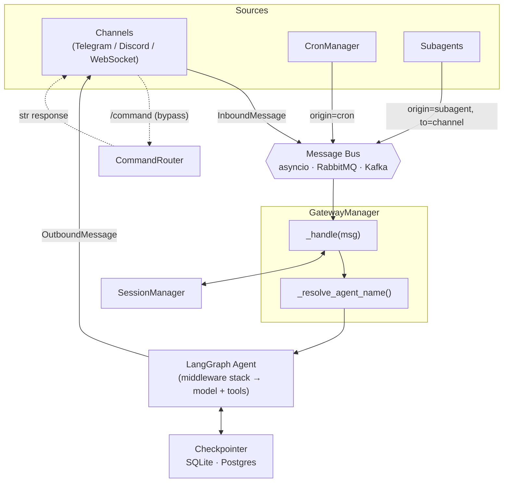

# Architecture

## Message flow

Every message — user, cron job, or subagent — converges on the same bus and flows through the same `_handle()` pipeline:



**Commands** (`/start`, `/reset`, `/help`, `/agent`) bypass the bus and LLM — `CommandRouter` handles them synchronously before the message enters the pipeline. The one exception is `/agent <name> <message>` (one-off), which publishes the message to the bus for normal agent handling.

## Agent name resolution

`_resolve_agent_name` resolves in priority order:

1. `msg.metadata["agent_name"]` — stamped by cron at schedule time (deterministic)
2. `SessionManager.get_active_agent()` — set by `/agent` command
3. `"default"` — fallback

## Middleware stack

The stack in `agents/builder.py`, from first-run to last-run on input:

```
ChannelContextMiddleware          1. inject channel metadata (always)
capability filter                 2. tool + workflow RBAC      (if permissions.enabled)
subagent gate                     3. `task` subagent_type RBAC (if permissions.enabled)
CodeInterpreterMiddleware         4. eval tool                 (if interpreter.enabled)
RateLimitMiddleware               5. per-user rate limiting
ContentFilterMiddleware           6. content filtering
PIIMiddleware                     7. PII redaction
[user-provided middleware]        8. app.add_middleware(...) — runs last
```

The RBAC steps (2–3, built by `build_capability_filter_middleware` /
`build_subagent_permission_middleware`) and the interpreter (4) are conditional;
the interpreter is placed **after** the capability filter so a role-stripped tool
is never reachable from the `eval` sandbox.

## Pluggable backends

Every backend follows the same pattern: abstract `base.py` + factory function.

| Concern | Factory | Backends |
|---|---|---|
| Message bus | `make_message_bus` | asyncio, RabbitMQ, Kafka |
| Checkpointer | `make_checkpointer_backend` | SQLite, Postgres |
| Agent filesystem | `make_backend` | local_shell, filesystem, state, store |

Swap via env var — no code changes:

```bash
LANGCLAW__BUS__BACKEND=rabbitmq
LANGCLAW__CHECKPOINTER__BACKEND=postgres
LANGCLAW__AGENTS__BACKEND__BACKEND=filesystem
```

For the full sequence diagram and middleware order, see [Architecture Internals](../ARCHITECTURE.md).
